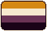

<h1 align="center">
  Hello :)))))))
</h1>

<h3 align="center">
  My name's Cody, or Moom! Whichever you please. You can call me that name anytime without asking.
    ↳  🌸 :: I use he/him, she/her, they/them, and ey/em pronouns.
    ↳  🌸 :: I'm Nonbinary, Sapphic, and AroAceFlux!
   
   
  

  🌸 I am a furry artist! I don't often chat much but you're free to engage in convo! 🌸
   🌸 My favorite color is pink and I'm honest to god obsessed with it. 🌸
   🌸 Main fandoms: Cookie Run & Team Fortress 2 🌸</h3>

 

Small boundaries!!
 I am usually in the Cookie Run area on ponytown, please don't:
 ↳ Ship my Dark Cacao with Affogato
 ↳ Attempt a roleplay
 ↳ Cover me w/o asking
 
 Taking inspo is fine! Shipping in general is fine!

<!--
**Mimoomsa/Mimoomsa** is a ✨ _special_ ✨ repository because its `README.md` (this file) appears on your GitHub profile.

Here are some ideas to get you started:

- 🔭 I’m currently working on ...
- 🌱 I’m currently learning ...
- 👯 I’m looking to collaborate on ...
- 🤔 I’m looking for help with ...
- 💬 Ask me about ...
- 📫 How to reach me: ...
- 😄 Pronouns: ...
- ⚡ Fun fact: ...
-->
